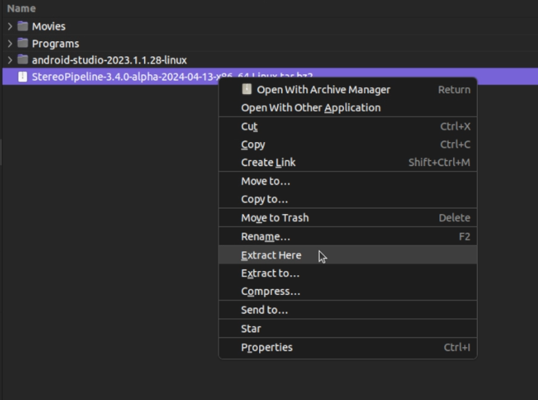

# Guía de uso de para la creación de DEMs con 'NASA Ames Stereo Pipeline'

<!-- vim-markdown-toc GFM -->

* [Instalación](#instalación)
* [Modo de uso](#modo-de-uso)
    * [Preparación de las imágenes](#preparación-de-las-imágenes)
    * [Generación de modelos de cámara](#generación-de-modelos-de-cámara)
    * [Generación de la nube de puntos](#generación-de-la-nube-de-puntos)
    * [Generación del DEM](#generación-del-dem)

<!-- vim-markdown-toc -->

El presente documento tiene como objetivo guiar al usuario en la creación de Modelos Digitales de Elevación (DEM) a partir de imágenes estéreo utilizando el software de código abierto 'NASA Ames Stereo Pipeline' (ASP).

La documentación completa del programa se encuentra en [https://stereopipeline.readthedocs.io/en/latest/](https://stereopipeline.readthedocs.io/en/latest/)

## Instalación

1. Descarga el programa desde [https://github.com/NeoGeographyToolkit/StereoPipeline/releases](https://github.com/NeoGeographyToolkit/StereoPipeline/releases)

> \[!NOTE\]
> Asegurate de descargar la versión correspondiente a tu sistema operativo (Linux o Mac (OSX))

2. Extrae el contenido del archivo descargado en una carpeta de tu elección

Desde la línea de comandos:

```bash
cd <CarpetaDescargaStereoPipeline>
tar -xvzf StereoPipeline-3.4.0-alpha-2024-04-13-x86_64-Linux.tar.bz2
```

> \[!NOTE\]
> El nombre del archivo puede variar dependiendo de la versión y la fecha de lanzamiento

O desde el explorador de archivos:

- Haz clic derecho sobre el archivo descargado
- Selecciona la opción 'Extract Here'



3. Abre una terminal y navega hasta la carpeta extraida y luego `/bin` donde se encuentran todos los ejecutables necesarios

```bash
cd StereoPipeline-3.4.0-alpha-2024-04-13-x86_64-Linux/bin
```

4. Comprueba al instalación mediante un comando de ayuda

```bash
./stereo --help
```
______________________________________________________________________


## Modo de uso

### Preparación de las imágenes

- Descarga las imágenes a procesar

- Algunos productos entregan imágenes en varias sub-imagenes (por ej. una misma foto dividida en 2 una partes). En este caso, es necesario unirlas. Para este proceso se pueden usar los ejecutables:
    - `image_mosaic`: Para fotos genéricas
    - `dg_mosaic`: Para el caso de imágenes de origen `Digital Globe`
    - `dem_mosaic`: Para los modelos de elevación

Ejemplo de uso:

```bash
./image_mosaic DZB00401800038H026001_a.tif DZB00401800038H026001_b.tif -o DZB00401800038H026001.tif --ot byte --blend-radius 2000 --overlap-width 10000
```

> \[!NOTE\]
> El comando anterior asume que las imágenes se encuentran en el mismo directorio que el ejecutable. Si no es así, es necesario especificar la ruta completa de las imágenes.

> \[!WARNING\]
> El orden de las imagenes es importante. La primera imagen debe ser la izquierda y la segunda la derecha.

- Puede ser necesario recortar las imágenes para eliminar bordes o áreas no deseadas. Para ello se puede usar el programa `./historical_helper.py`.

```bash
./historical_helper.py rotate-crop --interest-points '566 2678  62421 2683  62290 33596  465 33595' --input-path DZB00401800038H026001.tif --output-path 6001.tif
```

> [!NOTE]
> La flag --interest-points son pares de coordenadas (x, y) que definen un rectángulo del área de intéres.

### Generación de modelos de cámara

```bash
../StereoPipeline/bin/cam_gen --pixel-pitch 7.0e-06 --focal-length 1.96                             \
  --optical-center 0.2082535 0.1082305                                        \
  --lon-lat-values '113.25 22.882 113.315 23.315 113.6 23.282 113.532 22.85'  \
  5001.tif --reference-dem srtm_dem.tif --refine-camera -o 5001.tsai
```

Este procedimiento crea un archivo modelo de camara que se ve de la siguiente manera:

```
VERSION_4
PINHOLE
fu = 1.96
fv = 1.96
cu = 0.20825350000000001
cv = 0.10823049999999999
u_direction = 1 0 0
v_direction = 0 1 0
w_direction = 0 0 1
C = -2302887.2475388511 5596984.855256659 2570133.2802576395
R = 0.029696663532210787 -0.99066800259147503 -0.13302261768764051 -0.37884927950831415 0.11199670002408149 -0.91865660755243439 0.92498180068101132 0.077676559045399385 -0.37198793069638791
pitch = 6.9999999999999999e-06
NULL
```

Si se desea, se puede evaluar el modelo de camarar creando un `kml` que mostrará la posición de la cámara en el espacio y que puede ser comparado con un DEM de referencia.

```bash
camera_footprint 5001.tif  5001.tsai  --datum  WGS_1984 --quick \
  --output-kml  5001_footprint.kml -t nadirpinhole --dem-file srtm_dem.tif
```

Es buena idea experimentar con copias de las imágenes de entrada antes de ejecutar el procesamiento con las imágenes de tamaño completo.
Para esto se puede usar el ejecutable `stereo_gui`.

Por ejemplo para el archivo `5001.tif`:

```bash
stereo_gui 5001.tif --create-image-pyramids-only
```

Este comando crea varias imágenes de tamaño reducido que pueden ser usadas para probar el proceso de generación de modelos de cámara.
Ejemplo de nombres de archivos generados:

```
>>> 5001_sub16.tif
>>> 5001_sub2.tif
>>> 5001_sub32.tif
>>> 5001_sub4.tif 
>>> 5001_sub64.tif 
>>> 5001_sub8.tif
```

Asegurate de hacer copias de los archivos de modelo de cámara y escalar el pitch para que coincida con el tamaño de la imagen reducida. Ejemplo para `5001_sub64.tsai`:

```bash
VERSION_4
PINHOLE
fu = 1.96
fv = 1.96
cu = 0.20825350000000001
cv = 0.10823049999999999
u_direction = 1 0 0
v_direction = 0 1 0
w_direction = 0 0 1
C = -2302887.2475388511 5596984.855256659 2570133.2802576395
R = 0.029696663532210787 -0.99066800259147503 -0.13302261768764051 -0.37884927950831415 0.11199670002408149 -0.91865660755243439 0.92498180068101132 0.077676559045399385 -0.37198793069638791
pitch = 6.9999999999999999e-06 * 64
NULL
```

### Generación de la nube de puntos

Genera una nube de puntos a partir de las imágenes estéreo mediante la herramienta `stereo` o `parallel_stereo`. La elección de una u otra dependerá de la cantidad de imágenes a procesar y/o la capacidad de procesamiento de tu equipo, `parallel_stereo` permite procesamiento en paralelo.

Ejemplo de uso basico:

```bash
stereo primera_imagen.tif segunda_imagen.tif --output-prefix lugar_output
```

Ejemplo de uso avanzado usado en imagenes `KH`:

```bash
parallel_stereo --alignment-method homography                      \
  --skip-rough-homography --disable-tri-ip-filter                  \
  --ip-detect-method 1 --session-type nadirpinhole                 \
  5001_small.tif 6001_small.tif                                    \
  bundle_small_new/out-out-5001_small.tsai                         \
  bundle_small_new/out-out-6001_small.tsai                         \
  st_small_new/out
```

Este proceso creará un archivo `lugar_output-PC.tif` que contiene la nube de puntos.

### Generación del DEM

Crea el DEM desde la nube de puntos mediante el ejecutable `point2dem`:

```bash
point2dem --stereographic --auto-proj-center <archivo_nube_puntos>.tif
```

Finalmente visualiza el archivo `output` desde un software GIS u otra herramienta a elección.
